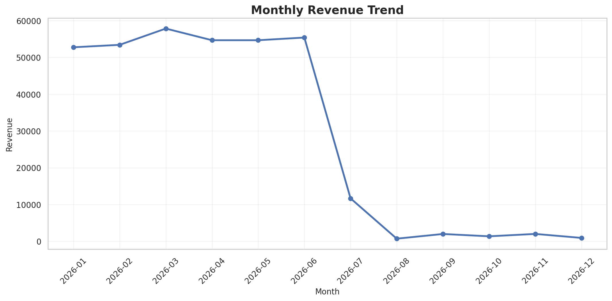
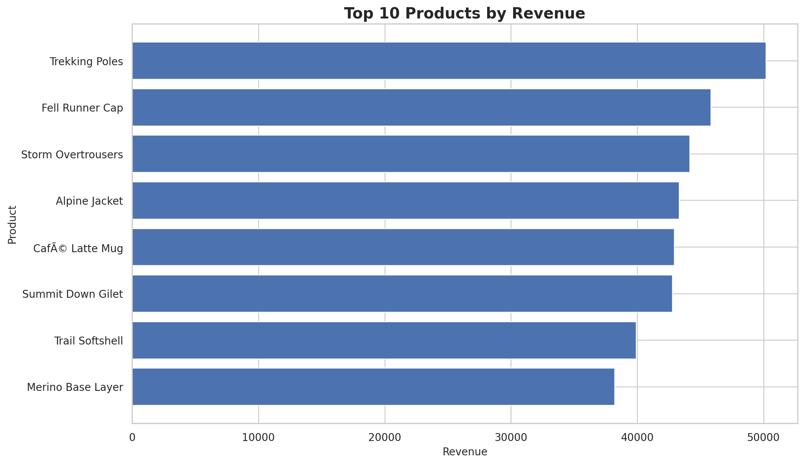
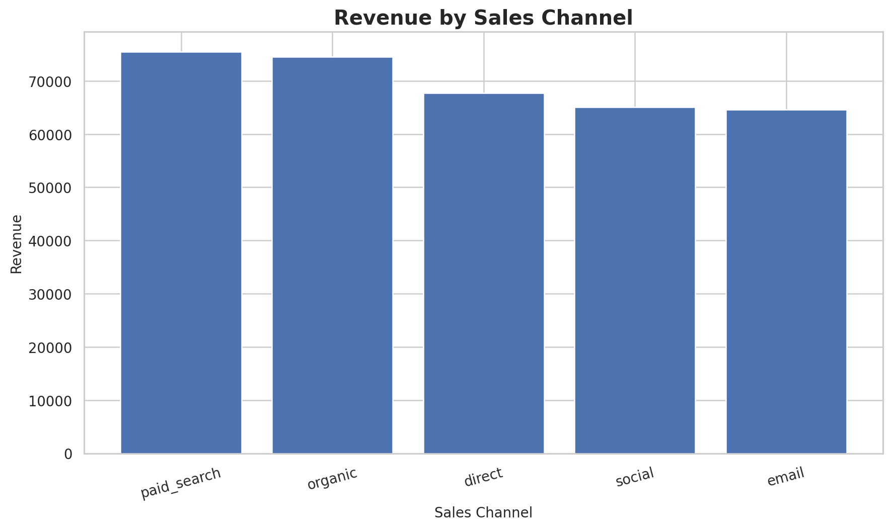
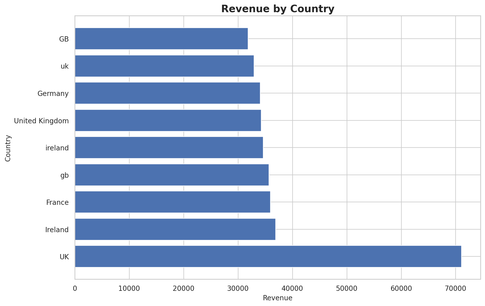
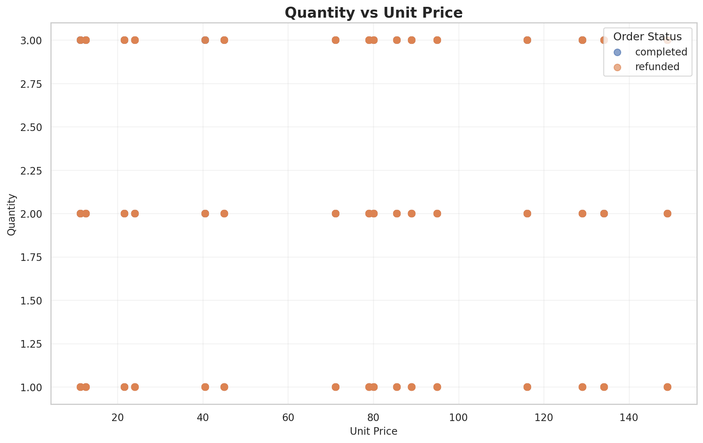
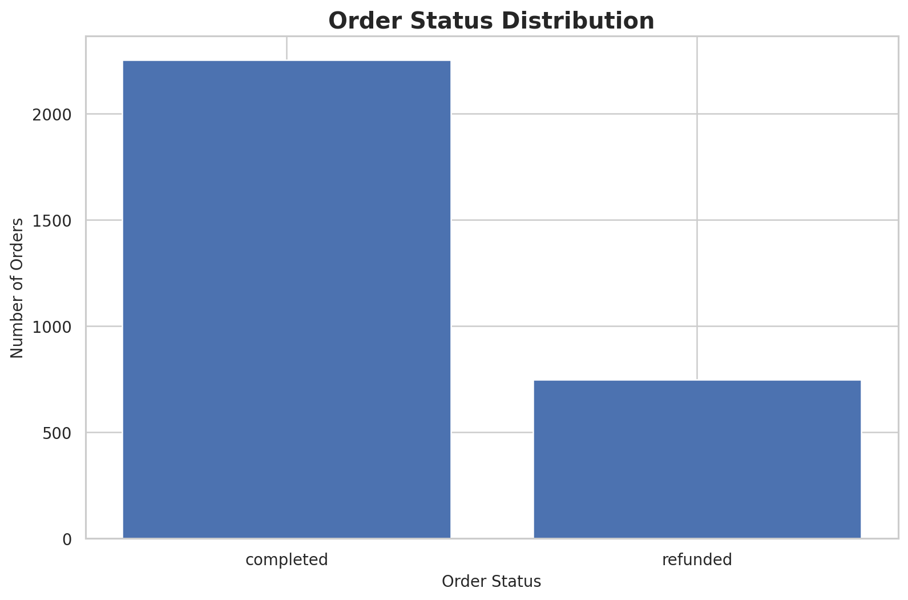
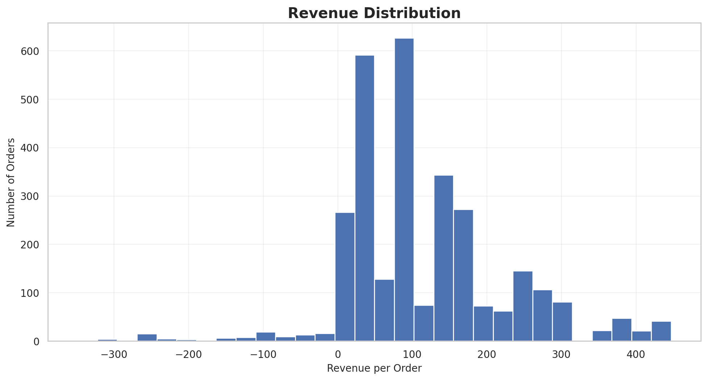
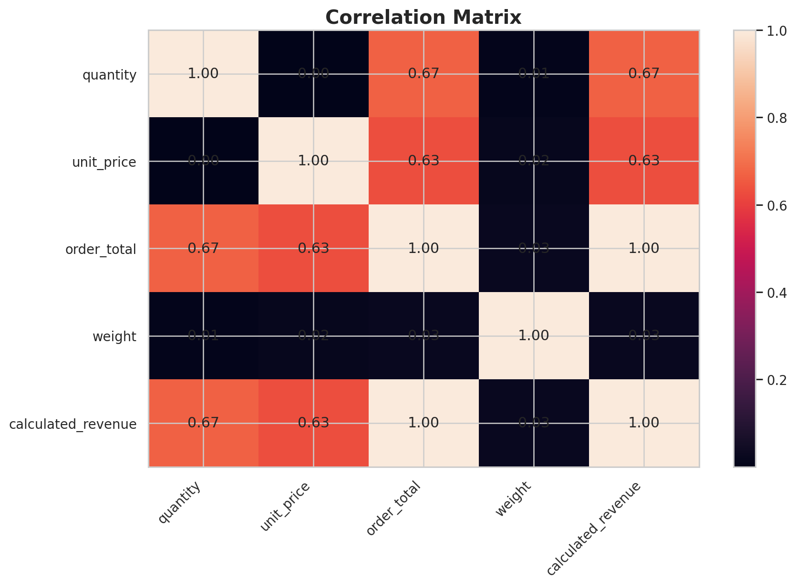

# 🛒 E-Commerce Data Analysis

<p align="center">
  <b>End-to-end data analytics project using Python, Pandas, Seaborn &amp; Matplotlib, with a Power BI-ready dataset</b>
</p>

<p align="center">
  
  
  
  
  
</p>

---

## 📌 Overview

This project turns messy e-commerce transaction data into a clean, validated, analysis-ready dataset, then explores sales trends, products, channels, countries, pricing, and order status.

**Workflow:** Data Understanding → Cleaning → Validation → EDA → Visualization → Business Insights → Dashboard Preparation

## 🎯 Objectives

- Clean and validate e-commerce transaction data
- Analyze revenue trends over time
- Identify top-performing products
- Compare sales channels and countries
- Understand completed vs. refunded orders
- Explore the relationship between quantity and unit price
- Produce a dataset ready for Power BI

## 🔑 Key Findings

> Fill these in from your notebook results. Recruiters read this section first.

| Metric | Result |
|---|---|
| Total orders (after cleaning) | `[N]` |
| Total revenue (per currency) | `[EUR X / GBP Y]` |
| Average order value | `[X]` |
| Refund rate | `[X%]` |
| Best month | `[Month, Year]` |
| Top product | `[Product name]` |
| Top channel | `[Channel]` |
| Top country | `[Country]` |

**Takeaways**

1. `[One-sentence insight about the revenue trend]`
2. `[One-sentence insight about products or channels]`
3. `[One-sentence insight about refunds or geography]`

## 📊 Dataset

The original dataset has **3,047 records and 13 columns**.

| Column | Description |
|---|---|
| `order_id` | Order identifier |
| `order_date` | Order date (mixed formats in source) |
| `customer_email` | Customer identifier |
| `country` | Customer country |
| `channel` | Sales channel |
| `product_sku` | Product SKU |
| `product_name` | Product name |
| `quantity` | Quantity ordered |
| `unit_price` | Price per unit |
| `order_total` | Recorded order total |
| `weight` | Product weight |
| `currency` | Transaction currency (EUR or GBP) |
| `status` | Order status |

> ⚠️ **Currency note:** The data contains both EUR and GBP. Revenue is **not** summed across currencies. `[State here how you handled it: analyzed separately per currency / converted at a fixed rate of X / etc.]`

> 🔒 **Privacy note:** `[State whether customer_email is anonymized or synthetic. If real, remove or hash it before publishing.]`

## 🧹 Data Cleaning

### Data-quality issues found

| Check | Count |
|---|---:|
| Original records | 3,047 |
| Duplicate rows | 47 |
| Duplicate order IDs | 47 |
| Missing unit prices | 228 |
| Non-positive quantities | 102 |
| Order-total mismatches | 208 |

### How each issue was handled

| Issue | Treatment |
|---|---|
| Duplicate rows / order IDs | `[e.g., dropped, keeping first occurrence]` |
| Missing unit prices | Recovered where possible (see below); otherwise `[excluded / flagged]` |
| Non-positive quantities | `[e.g., treated as returns / flagged / removed]` |
| Order-total mismatches | `[e.g., flagged with a validation column / recomputed]` |
| Mixed date formats | Parsed and standardized to a single datetime format |
| Text fields | Trimmed and standardized (case, whitespace) |

**Final cleaned dataset:** `[N]` rows × `[N]` columns

### Missing price treatment

Missing `unit_price` values were investigated rather than filled with zero. Where `order_total` and `quantity` were valid:

```text
Recovered Unit Price = Order Total / Quantity
Calculated Revenue   = Quantity × Unit Price
```

## 🔎 Exploratory Data Analysis

### 📈 Monthly Revenue Trend


### 🏆 Top 10 Products by Revenue


### 📣 Revenue by Sales Channel


### 🌍 Revenue by Country


### 🔎 Quantity vs. Unit Price


### 📦 Order Status Distribution


### 📊 Revenue Distribution


### 🔗 Correlation Matrix


## 🛠️ Tech Stack

| Area | Tools |
|---|---|
| Language | Python 3.x |
| Data | Pandas, NumPy |
| Visualization | Matplotlib, Seaborn |
| BI | Power BI (dashboard plan) |
| Environment | Jupyter Notebook |
| Version control | Git & GitHub |

## 📁 Project Structure

```text
Ecommerce-Data-Analysis/
├── ecommerce_analysis.ipynb
├── ecommerce_cleaned.csv
├── requirements.txt
├── README.md
├── LICENSE
├── 01_monthly_revenue_trend.png
├── 02_top_10_products_revenue.png
├── 03_revenue_by_sales_channel.png
├── 04_revenue_by_country.png
├── 05_quantity_vs_unit_price.png
├── 06_order_status_distribution.png
├── 07_revenue_distribution.png
└── 08_correlation_heatmap.png
```

## 🚀 Run Locally

```bash
git clone https://github.com/Nayan0223/Ecommerce-Data-Analysis.git
cd Ecommerce-Data-Analysis
pip install -r requirements.txt
jupyter notebook
```

Open `ecommerce_analysis.ipynb` and run all cells from top to bottom.

Example `requirements.txt`:

```text
pandas
numpy
matplotlib
seaborn
jupyter
```

## 📈 Power BI Dashboard Plan

The cleaned dataset is prepared for a Power BI dashboard. *(Add screenshots or the `.pbix` file here once built.)*

**KPI cards:** Total Orders · Total Revenue · Total Customers · Average Order Value · Refund Rate · Total Quantity

**Visuals:** Monthly Revenue Trend · Revenue by Country · Revenue by Channel · Top Products · Order Status · Quantity vs. Unit Price · Currency-aware revenue

**Filters:** Date · Country · Channel · Product · Status · Currency

## 🧠 Skills Demonstrated

`Python` · `Pandas` · `NumPy` · `Matplotlib` · `Seaborn` · `EDA` · `Data Cleaning` · `Data Validation` · `Power BI (dashboard design)`

## 👨‍💻 Author

**Nayan Bharodiya**
BCA Graduate | Aspiring Data Analyst

## ⭐ Project Goal

> **Turn messy transactional data into reliable, understandable, and business-ready insights.**

If you find this project useful, consider giving the repository a ⭐.

## 📜 License

Released under the [MIT License](LICENSE).
